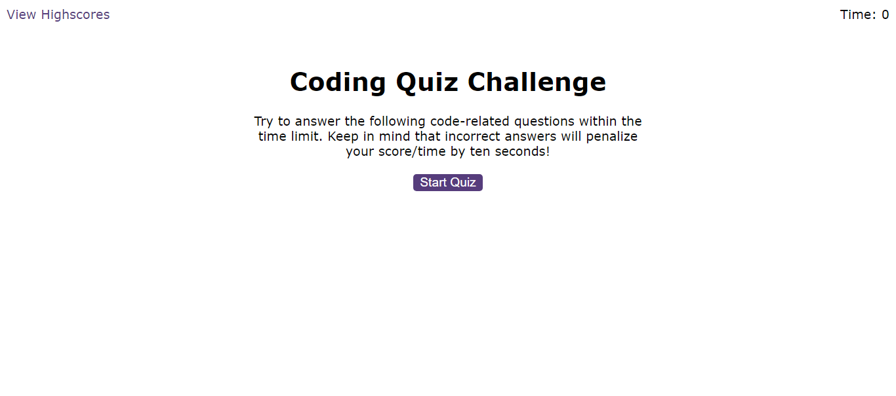

# Feyse Coding Quiz App

Coding Quiz App is a web application that challenges users with coding-related questions. It's an interactive way for developers to test their programming knowledge.

## Table of Contents

- [Feyse Coding Quiz App](#feyse-coding-quiz-app)
  - [Table of Contents](#table-of-contents)
  - [Features](#features)
  - [Demo](#demo)
  - [Installation](#installation)
  - [Usage](#usage)
  - [Contributing](#contributing)
  - [Acknowledgments](#acknowledgments)
  - [Contact](#contact)

## Features

- Multiple-choice coding questions covering various programming languages.
- Timer functionality to track the time taken to complete the quiz.
- Score calculation based on correct answers and time remaining.
- High scores leaderboard to showcase top performers.

## Demo

View a live demo of the Coding Quiz App [here](https://dodomiyake.github.io/feyse-coding-quiz-challenge/).



## Installation

To set up the Coding Quiz App locally, follow these steps:

1. Clone the repository:

    ```bash
    git clone https://github.com/your-username/coding-quiz-app.git
    cd coding-quiz-app
    ```

2. Open the `index.html` file in your preferred web browser.

## Usage

1. Click the "Start Quiz" button to begin the quiz.
2. Answer the multiple-choice coding questions within the given time.
3. After completing the quiz, view your score and compare it with others on the leaderboard.

## Contributing

If you'd like to contribute to the Coding Quiz App, follow these steps:

1. Fork the repository.
2. Create a new branch: `git checkout -b feature-name`.
3. Make your changes and commit them: `git commit -m 'Add feature'`.
4. Push to the branch: `git push origin feature-name`.
5. Submit a pull request.

## Acknowledgments

Feel free to explore and customize the Coding Quiz App based on your project's needs.

## Contact

- Email: [oluwadamilola.william@gmail.com](mailto:oluwadamilola.william@gmail.com)
- LinkedIn: [Oluwadamilola's LinkedIn Profile](https://www.linkedin.com/in/oluwadamilolaxajayi)
- GitHub: [Dodo Miyake on GitHub](https://github.com/dodomiyake)

Looking forward to connecting with you!

---
